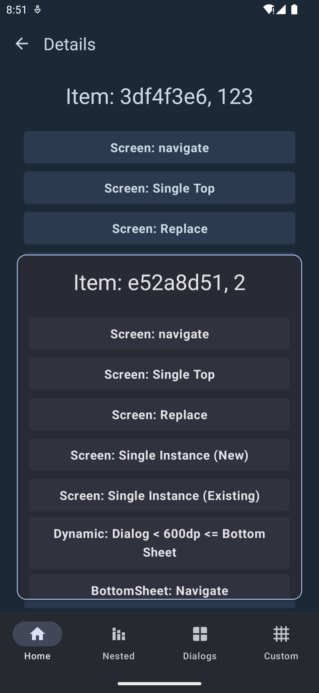

# Bottom Sheet

One of the motivations behind creating this library is allowing a bit more freedom when using bottom sheets or dialogs. Changing their behaviour in real-time and making them more stateful. That's why Guia renders the bottom sheets in a slightly altered version of a `ModalBottomSheetLayout` that has smoother transition animations between bottom sheets and allows for changing its behavior in real-time.

```kotlin
class BottomSheet(
    override val content: @Composable () -> Unit
) : NavigationNode {
    ..
    var bottomSheetOptions by mutableStateOf(BottomSheetOptions())
    ..
}
```

Every `BottomSheet` has a sateful `BottomSheetOptions` that can be updated at any time:

<pre class="language-kotlin"><code class="lang-kotlin">data class BottomSheetOptions(
    val scrimColor: Color? = null,
<strong>    val confirmStateChange: (value: BottomSheetValue) -> Boolean = { true },
</strong>    val dismissOnClickOutside: Boolean = true,
    val onOutsideClick: () -> Unit = {}
)
</code></pre>

Navigating between two bottom sheets will animate the content of the bottom sheet container that hosts them.

### Updating BottomSheet state

Note that `BottomSheetOptions` currently are not saved/restored so make sure you have a backing saveable state if needed in your Composable.

```kotlin
@Composable
fun MyBottomSheet() {
    val bottomSheet = requireLocalBottomSheet() // Get the local bottom sheet node
    var scrimColor by remember { mutableStateOf(Color.Back) }
    
    LaunchedEffect(scrimColor) {
        bottomSheet.bottomSheetOptions = bottomSheet.bottomSheetOptions.copy(
            scrimColor = scrimColor
        )
    }
    
    Button(onClick = { 
        scrimColor = if (scrimColor == Color.Black) {
            Color.White
        } else {
            Color.Black
        }
    }) {
        Text(text = "Toggle Scrim!")
    }
}
```

<div>

<figure><figcaption></figcaption></figure>

 

<figure><figcaption></figcaption></figure>

</div>
