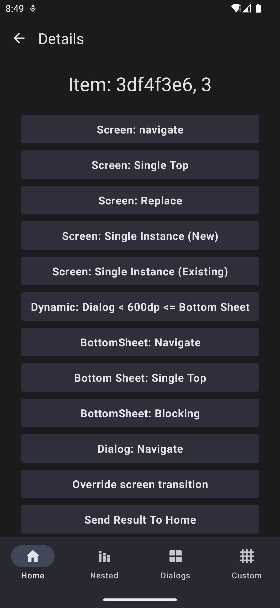

# Screen

A `Screen` doesn't necessarily mean a full screen page. The dimensions of the screen are controlled by the container it's hosted in and its own dimensions. But it's a convenient name for defining a UI that isn't a `BottomSheet` or a `Dialog`.

```kotlin
class Screen(
    override val content: @Composable () -> Unit
) : NavigationNode
```

<div>

<figure><figcaption></figcaption></figure>

 

<figure><figcaption></figcaption></figure>

 

<figure><figcaption></figcaption></figure>

</div>
